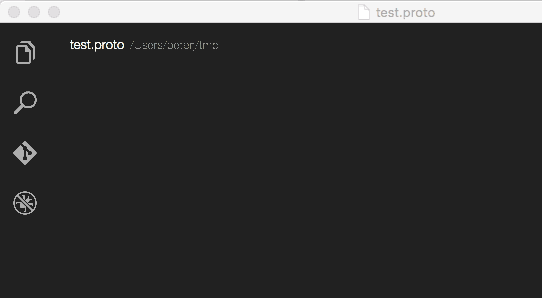

# Protobuf support for Visual Studio Code

## Functionality 
This extensions adds syntax highlighting and bracket matching for .proto files (protobuf) in VS code. This extension is using this tmbundle: https://github.com/kevinweil/protobuf.tmbundle.

## Installation
Launch Visual Studio code, press `F1` and type `ext install` to bring up the list of extensions. Pick `Protobuf support` from the list to install the extension. Restart Visual Studio Code and you should be ready to go. Alternatively, you can copy the contents of the repo under `~/.vscode/extensions/vscode-protobuf`.